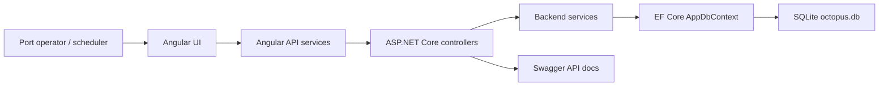

# Octopus Architecture

Octopus is split into a frontend Angular client and a backend ASP.NET Core API.

## Frontend

The Angular application lives in `frontend/octopus-ui`.

- `components/operator` shows operational state.
- `components/scheduler` shows berth assignment planning.
- `components/ships` lists vessel information.
- `components/berths` lists berth capacity and availability.
- `services` wraps API access.
- `models` defines TypeScript interfaces shared by UI features.

## Backend

The API lives in `backend/Octopus.Api`.

- `Controllers` expose REST endpoints.
- `Services` contain application behavior.
- `Models` define domain entities.
- `Data` contains the starter context, seed data, and migrations folder.
- `DTOs` is reserved for request and response contracts.

## Runtime Flow

1. Angular routes render operator, scheduler, ships, and berths views.
2. Angular services call `/api/*` endpoints.
3. Controllers delegate to services.
4. Services read and write through EF Core.
5. SQLite persists ships, berths, assignments, and system state.
6. `SeedData` initializes fixed berths and the starting system day.

## Architecture Diagram

## Backend Architecture

The backend follows a simple controller-service-data structure for Sprint 1:

- Controllers expose HTTP endpoints.
- Services hold application behavior and persistence calls.
- EF Core maps domain models to SQLite.
- Seed data creates fixed berths and initializes `CurrentDay`.

## Database Architecture

SQLite is configured through the `OctopusDb` connection string. EF Core migrations live in `backend/Octopus.Api/Data/Migrations`.
